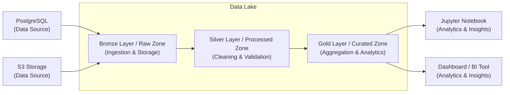

# Coding Workshop - Data Engineer Guide

> [Main Guide](./README.md) | [Validation Guide](./validation.md) | [Full Stack Guide](./full-stack.md) | **Data Engineer Guide** | [System Engineer Guide](./system-engineer.md) | [UI/UX Engineer Guide](./ui-ux-engineer.md)

## Overview

This guide provides directions and guidelines on implementation expectations
but you are free to exercise your creativity to showcase your technical skills
combined with soft skills such as curiosity, observability, and ability to
drive / deliver value.

* [Architecture Diagram](#architecture-diagram)
* [Evaluation Expectations](#evaluation-expectations)
* [Testing Expectations](#testing-expectations)
* [Implementation Expectations](#implementation-expectations)

## Architecture Diagram



## Evaluation Expectations

Candidates are evaluated on five technical competencies (specifically: 1. Implementation, 2. Design, 3. Code, 4. Testing, 5. Experience) and three soft skills (specifically: 1. Curious, 2. Observant, 3. Driven). Each technical competency is scored on a scale of 1 (lowest) to 10 (highest). The technical assessment result is the average of those scores. The soft skills are evaluated using the same scoring approach. The final overall evaluation is the average of the technical and soft skills results, as follows:

Evaluation    | Excellent     | Good          | Satisfactory   | Incomplete
--------------|---------------|---------------|----------------|-----------
*Score Range* | *9 or higher* | *7 or higher* | *5 or higher*  | *below 5*

Here below are more details on the technical competencies expectations:

1. **Implementation**

  - Bronze, Silver, and Gold layers are implemented and wired end-to-end.
  - Jobs can run locally and in cloud mode without manual code changes.
  - Pipelines are idempotent or incrementally safe, with no duplicate output on reruns.
  - Data outputs are queryable and usable for downstream analytics.

2. **Design**

  - Pipeline design clearly separates ingestion, transformation, and serving concerns.
  - Medallion boundaries and storage paths are consistent and documented.
  - Schema contracts and data quality checks are explicit at each layer.
  - Partitioning and file layout choices support scalability and cost efficiency.

3. **Code**

  - Code is modular, readable, and avoids duplicated transformation logic.
  - Configuration is externalized via environment variables and not hardcoded.
  - Logging and exception handling provide actionable diagnostics.
  - Naming conventions, typing/docstrings, and folder structure are consistent.

4. **Testing**

  - Unit tests validate core transformations and schema validation rules.
  - Integration tests validate read/write behavior with PostgreSQL and S3.
  - Reconciliation checks confirm row counts and aggregates across layers.
  - Test evidence (commands, output, and conclusions) is documented.

5. **Experience**

  - Setup and execution instructions are clear and reproducible.
  - Visual storytelling explains findings for both technical and business audiences.
  - Trade-offs, assumptions, and known limitations are explicitly called out.
  - Delivery quality reflects ownership, clarity, and maintainability.

## Testing Expectations

### Functional Testing

Functional testing should verify that each pipeline step produces correct and complete outputs.

1. Source Ingestion Validation: Confirm source records are ingested into Bronze with expected row counts and required columns.
2. Transformation Validation: Validate cleaning, casting, filtering, and deduplication behavior in Silver.
3. Aggregation Validation: Verify Gold metrics (counts, averages, totals) against known expected values.
4. Data Quality Validation: Confirm invalid rows are quarantined and quality rules are enforced.
5. Idempotency Validation: Run the same job twice and confirm no duplicate records are introduced.

### Performance Testing

Performance testing should demonstrate acceptable runtime and stability under realistic data volumes.

1. Batch Throughput Test: Measure records processed per minute for representative datasets.
2. Scale Test: Execute jobs with small, medium, and large input sizes to identify nonlinear slowdowns.
3. Resource Efficiency Test: Monitor memory and CPU usage during heavy transformations.
4. External Dependency Test: Validate retry/backoff behavior for transient PostgreSQL or S3 failures.
5. SLA Verification: Confirm end-to-end job completion time meets expected delivery windows.

### Test Coverage Goals

* Core transformation functions: 80%+ coverage
* Schema and validation rules: 90%+ coverage
* Error-handling and retry paths: 85%+ coverage
* Critical business metric calculations: 95%+ coverage
* End-to-end pipeline smoke test: 100% for at least one representative flow

### Examples: How To Test

#### Local Development

To test your job changes locally:

```sh
# Install dependencies for your job
pip install -r ../data/{{job-name}}/requirements.txt

# Run the job locally
python ../data/{{job-name}}/job.py 2>&1 | tee /tmp/{{job-name}}.log
tail -f /tmp/{{job-name}}.log
```

Replace `{{job-name}}` with your job directory (for example, `citi-daily-etl`).

#### Cloud Deployment

To test your job changes in the cloud:

```sh
# Deploy changes
../bin/deploy-backend.sh

# Stream logs from the active Kubernetes Job pod
kubectl logs -f job/python-job
```

## Implementation Expectations

### 1. Data Processing & ETL (Batch Jobs)

ETL batch jobs are responsible for reading data, transforming it, and moving it between the Medallion layers.

**Expected Capabilities**
*   [ ] Execute batch jobs using Apache Spark, PySpark, Python, or Pandas.
*   [ ] Read and write data efficiently from S3 and PostgreSQL.
*   [ ] Support incremental loading or clear idempotence (running the job multiple times on the same input produces the same output without duplicates).
*   [ ] Handle API rate limits and database connections gracefully.

**How to Create New Data Jobs**

Python/Pandas is the recommended toolset, but Scala/Java Spark jobs are also supported. To create a new batch data job from an example skeleton, run the following command:

```sh
cp -R ../data/_examples/{{coding-language}}-job ../data/{{job-name}}
```

Replace `{{coding-language}}` with either `python` or `java`, and replace `{{job-name}}` with your new job directory name.

When you create a new data job, make sure to restart the development environment or execute the build/deploy scripts to make them active:

```sh
../bin/deploy-backend.sh
```

> [!NOTE]
> Structure your data pipelines to prioritize code reuse. Shared helpers for database connections, schema validation, and logging should be refactored into utility modules rather than duplicated across jobs.

### 2. Data Sources & Connections

Your pipelines will interact with local databases, cloud services, and S3 objects.

**Database Environment Variables**

Predefined environment variables are injected into your execution environment automatically. Use these variables to establish database connections:

| Variable        | Description           | Local                  | Cloud                   |
| --------------- | --------------------- | ---------------------- | ----------------------- |
| `IS_LOCAL`      | Is it local or cloud? | `true`                 | `false`                 |
| `POSTGRES_HOST` | PostgreSQL hostname   | `localhost`            | AWS Aurora endpoint     |
| `POSTGRES_PORT` | PostgreSQL port       | `5432`                 | `5432`                  |
| `POSTGRES_NAME` | PostgreSQL name       | *(empty)*              | AWS Aurora database     |
| `POSTGRES_USER` | PostgreSQL username   | *(empty)*              | AWS Aurora username     |
| `POSTGRES_PASS` | PostgreSQL password   | *(empty)*              | AWS Aurora password     |

> [!TIP]
> Use `IS_LOCAL` to branch connection parameters. For example, AWS Aurora clusters require SSL (`sslmode=require`), whereas local PostgreSQL instances do not.

### 3. Schema Validation & Data Quality

Ensuring data quality prevents downstream analytical errors.

**Expected Capabilities**
*   [ ] Validate that required columns and fields are present and non-null.
*   [ ] Validate data types (e.g., date formats, integer scales, decimal ranges).
*   [ ] Enforce domain constraints (e.g., ages must be positive, ratios must be between 0% and 100%).
*   [ ] Log and isolate schema validation failures rather than allowing the entire pipeline to fail.
*   [ ] Route invalid records to a quarantine/dead-letter folder for troubleshooting.

### 4. Data Lineage & Observability

You must track how data flows through the pipeline to ensure auditability and maintainability.

**Expected Capabilities**
*   [ ] Log the count of records read, successfully processed, and written at each step.
*   [ ] Log job start time, end time, duration, and exit status.
*   [ ] Document source-to-target mappings, identifying exactly where columns are renamed, cast, or aggregated.
*   [ ] Implement structured logging (`INFO`, `WARN`, `ERROR`) to make troubleshooting straightforward.

### 5. Interactive Visualization & Insights (Jupyter)

Jupyter Notebooks act as the user interface for the Data Engineer, allowing you to load curated datasets and analyze them to answer critical business questions.

**Expected Capabilities**
*   [ ] Connect to S3 / PostgreSQL and load Gold/Curated data.
*   [ ] Answer all business scenario questions clearly using code and narrative markdown cells.
*   [ ] Generate clear visualizations (e.g., bar charts, line plots, histograms) to show distributions, headcounts, or performance ratings.
*   [ ] Keep notebooks organized and readable for non-technical stakeholders.

### 6. Pipeline Validation Checklist

**Bronze Layer Validation**
*   [ ] Check that S3 file size matches source data exports.
*   [ ] Verify partition keys (e.g., `year=YYYY/month=MM/day=DD`) are correctly applied.
*   [ ] Ensure raw files are stored in immutable directories.

**Silver Layer Validation**
*   [ ] Confirm zero null values in non-nullable primary key columns.
*   [ ] Check that dates are correctly parsed and cast to date/timestamp types.
*   [ ] Verify conformed schemas match the standard design layout.
*   [ ] Ensure duplicate records are filtered out.

**Gold Layer Validation**
*   [ ] Verify aggregations (such as sums, counts, and averages) are mathematically correct.
*   [ ] Check that grain and cardinality of target tables are correct (e.g. one row per team per month).
*   [ ] Cross-validate Gold row counts against Silver row counts to verify no records were unexpectedly dropped.

## 7. Error Handling & Pipeline Resilience

Robust pipelines handle unexpected data and infrastructure issues gracefully.

**Common Error Conditions & Handling:**

| Error Condition | Impact | Recommended Resolution Strategy |
| --------------- | ------ | ------------------------------- |
| **Database Connection Timeout** | Pipeline fails to read/write. | Implement retry logic with exponential backoff; alert on multiple failures. |
| **Schema Drift / Mismatch** | Downstream jobs fail due to changed columns. | Use strict schema validation; catch exception, quarantine the file, and notify support. |
| **Malformed/Truncated Row** | Data corruption. | Drop/quarantine the bad row; write the remaining valid rows; log warning with row details. |
| **S3 Access Denied** | Ingestion or write fails. | Verify IAM Role permissions (EKS or S3 policies). |
| **Zero Rows Written** | Downstream jobs receive empty datasets. | Check if source dataset was empty; raise warning or halt pipeline depending on SLA. |

## Navigation Links

<nav aria-label="breadcrumb">
  <ol>
    <li><a href="./README.md">Main Guide</a></li>
    <li><a href="./validation.md">Validation Guide</a></li>
    <li><a href="./full-stack.md">Full Stack Guide</a></li>
    <li aria-current="page">Data Engineer Guide</li>
    <li><a href="./system-engineer.md">System Engineer Guide</a></li>
    <li><a href="./ui-ux-engineer.md">UI/UX Engineer Guide</a></li>
  </ol>
</nav>
