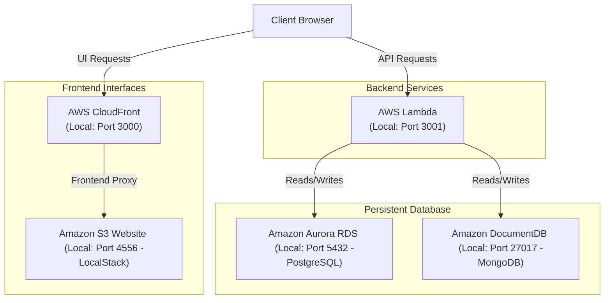

# Coding Workshop - Full Stack Guide

> [Main Guide](./README.md) | [Validation Guide](./validation.md) | **Full Stack Guide** | [Data Engineer Guide](./data-engineer.md) | [System Engineer Guide](./system-engineer.md) | [UI/UX Engineer Guide](./ui-ux-engineer.md)

## Overview

This guide provides directions and guidelines on implementation expectations
but you are free to exercise your creativity to showcase your technical skills
combined with soft skills such as curiosity, observability, and ability to
drive / deliver value.

* [Architecture Diagram](#architecture-diagram)
* [Evaluation Expectations](#evaluation-expectations)
* [Testing Expectations](#testing-expectations)
* [Implementation Expectations](#implementation-expectations)

## Architecture Diagram



## Evaluation Expectations

Candidates are evaluated on five technical competencies (specifically: 1. Implementation, 2. Design, 3. Code, 4. Testing, 5. Experience) and three soft skills (specifically: 1. Curious, 2. Observant, 3. Driven). Each technical competency is scored on a scale of 1 (lowest) to 10 (highest). The technical assessment result is the average of those scores. The soft skills are evaluated using the same scoring approach. The final overall evaluation is the average of the technical and soft skills results, as follows:

Evaluation    | Excellent     | Good          | Satisfactory   | Incomplete
--------------|---------------|---------------|----------------|-----------
*Score Range* | *9 or higher* | *7 or higher* | *5 or higher*  | *below 5*

Here below are more details on the technical competencies expectations:

1. **Implementation**

  - Application runs successfully in local development and cloud environments.
  - Frontend and backend integration supports complete CRUD workflows.
  - Infrastructure dependencies (API, storage, and databases) are configured correctly.
  - Deployment process is reproducible and produces verifiable outputs.

2. **Design**

  - UI layout is intuitive, responsive, and accessible across common screen sizes.
  - Information architecture is clear, with user flows that minimize friction.
  - Design choices are consistent (typography, spacing, colors, and interaction states).
  - Backend and frontend boundaries are clean, with maintainable API contracts.

3. **Code**

  - Code is modular and organized by feature/domain rather than monolithic files.
  - Error handling, validation, and edge cases are addressed in both layers.
  - Naming, formatting, and linting conventions are consistently applied.
  - Reusable components and utilities are favored over copy-paste implementations.

4. **Testing**

  - Unit and integration tests cover critical business logic and API contracts.
  - Frontend behavior is validated for core user journeys and error states.
  - Manual validation confirms end-to-end flow from UI through persistence layers.
  - Test artifacts (commands, results, and known gaps) are documented clearly.

5. **Experience**

  - Project can be set up and run locally using documented commands with minimal friction.
  - README/update notes clearly explain architecture, trade-offs, and assumptions.
  - User interactions are smooth, with clear feedback for loading, success, and failure states.
  - Delivery quality demonstrates ownership, communication clarity, and pragmatic decisions.

## Testing Expectations

### Backend Testing

1. Unit Tests: Test individual Lambda functions in isolation.
2. Integration Tests: Test API endpoints with actual database connections.
3. Error Handling Tests: Test validation and error scenarios for CRUD operations.

### Frontend Testing

1. Component Tests: Test React components using Jest and React Testing Library.
2. API Integration Tests: Test API service functions with mocked responses.
3. End-to-End Tests: Test complete user workflows using tools like Cypress or Selenium.

### Performance Testing

1. Load Testing: Test API endpoints under high concurrent load using tools like Artillery or JMeter.
2. Performance Monitoring: Monitor response times and resource usage to ensure optimal performance.

### Test Coverage Goals

* Backend Components: 80%+ code coverage
* Frontend Components: 80%+ code coverage
* API Endpoints: 90%+ coverage for all CRUD operations
* Error Handling: 90%+ coverage for validation and error cases
* Critical User Paths: 100% E2E test coverage

### Examples: How To Test

#### Local Development

To test your backend changes locally:

```sh
# Example: Get all records for {{service-name}}
curl -X GET https://localhost:3001/api/{{service-name}} \
     -H "Content-Type: application/json"
```

Replace `{{service-name}}` with corresponding service name
(e.g. `python-service`).

To tail backend logs in real-time:

```sh
# Example: Get logs for {{service-name}}
AWS_ENDPOINT_URL="http://localhost:4566" \
    aws logs tail /aws/lambda/{{function-name}} \
        --follow --format short --color on
```

Replace `{{function-name}}` with corresponding service name
(e.g. `coding-workshop-python-service-abcd1234`).

#### Cloud Deployment

To test your backend changes in the cloud:

```sh
# Example: Get all records for {{service-name}}
curl -X GET https://{API_BASE_URL}/api/{{service-name}} \
     -H "Content-Type: application/json"
```

Replace `{{service-name}}` with corresponding service name
(e.g. `python-service`).

To tail backend logs in real-time:

```sh
# Example: Get logs for {{service-name}}
aws logs tail /aws/lambda/{{function-name}} \
    --follow --format short --color on
```

Replace `{{function-name}}` with corresponding service name
(e.g. `coding-workshop-python-service-abcd1234`).

## Implementation Expectations

### 1. Backend Service

Backend service acts as the "brain" and "backbone" of modern applications,
responsible for data management, business logic, security, and integration
with dependent systems.

**Expected Capabilities**

- [ ] Store and manage data
- [ ] Authenticate and authorize users
- [ ] Communicate and integrate through API endpoints
- [ ] Execute service specific business logic
- [ ] Deliver real-time capabilities
- [ ] Handle async tasks where sync options are not feasible

**Key Attributes to Consider**

- Reliability and high availability
- Security and performance optimization
- Maintainability and modularity
- Monitoring and observability
- Documentation and API standards

**How to Create New Backend Services**

Python is the recommended coding language option, but we also added support for Java and NodeJS.

To create a new backend service from an example, just run the following command:

```sh
cp -R ../backend/_examples/{{coding-language}}-service ../backend/{{service-name}}
```

Replace `{{coding-language}}` with either `python`, `java` or `nodejs`, as well as `{{service-name}}` with your corresponding new service name.

When you create a new backend service, make sure to restart the development environment:

```sh
../bin/start-dev.sh
```

**Note:** As you create more services, think about how to restructure your files and folders to reuse code as much as possible (instead of copy-paste).

### 2. Data Persistence

Data should persist reliably and maintain consistency.

**Database Environment Variables**

Predefined environment variables are injected into each backend service automatically, simplifying the need to manage them manually:

| Variable        | Description           | Local                  | Cloud                   |
| --------------- | --------------------- | ---------------------- | ----------------------- |
| `IS_LOCAL`      | Is it local or cloud? | `true`                 | `false`                 |
| `POSTGRES_HOST` | PostgreSQL hostname   | `localhost`            | AWS Aurora endpoint     |
| `POSTGRES_PORT` | PostgreSQL port       | `5432`                 | `5432`                  |
| `POSTGRES_NAME` | PostgreSQL name       | *(empty)*              | AWS Aurora database     |
| `POSTGRES_USER` | PostgreSQL username   | *(empty)*              | AWS Aurora username     |
| `POSTGRES_PASS` | PostgreSQL password   | *(empty)*              | AWS Aurora password     |
| `MONGO_HOST`    | MongoDB hostname      | `host.docker.internal` | AWS DocumentDB endpoint |
| `MONGO_PORT`.   | MongoDB port          | `27017`                | `27017`                 |
| `MONGO_NAME`    | MongoDB db name       | *(empty)*              | AWS DocumentDB database |
| `MONGO_USER`    | MongoDB username      | *(empty)*              | AWS DocumentDB username |
| `MONGO_PASS`    | MongoDB password      | *(empty)*              | AWS DocumentDB password |

**Note:** Use `IS_LOCAL` to branch your connection logic:
- **PostgreSQL:** locally runs without SSL. When `IS_LOCAL` is `false`, add `sslmode=require` to your connection string for AWS Aurora.
- **MongoDB:** locally runs without TLS. When `IS_LOCAL` is `false`, add `tls=True`, `tlsAllowInvalidCertificates=True`, and `retryWrites=False` to your connection config for AWS DocumentDB.

**How to Enable Cloud Deploy for MongoDB**

PostgreSQL is the recommended database option, but we also added support for MongoDB which comes pre-installed locally, although not in the cloud. To enable the AWS DocumentDB (Mongo-compatible database), run the following commands:

```sh
echo "export TF_VAR_aws_mongo_enabled=true" >> ~/.bashrc
source ~/.bashrc
```

Going forward, every deploy backend execution will ensure that AWS DocumentDB is provisioned and available to be used in the cloud:

```sh
./bin/deploy-backend.sh
```

**Expected Capabilities**

- [ ] Created records persist in the database
- [ ] Updated records reflect changes accurately
- [ ] Deleted records are properly removed
- [ ] Retrieved records match stored data
- [ ] Database errors are handled appropriately

### 3. Data Validation

Proper validation ensures data integrity and provides helpful feedback to users.

**Expected Capabilities**

- [ ] Validate required fields are present and non-empty
- [ ] Validate field values meet expected formats and constraints
- [ ] Validate references to other entities exist before accepting
- [ ] Return meaningful error messages for validation failures
- [ ] Handle malformed input gracefully

### 4. API Design

The API should follow RESTful conventions and provide consistent responses.

**Expected Capabilities**

- [ ] Use appropriate HTTP methods for each operation (POST, GET, PUT, DELETE)
- [ ] Return appropriate HTTP status codes (201 for creation, 200 for success, 204 for deletion, 400 for validation errors, 404 for not found)
- [ ] Return JSON responses for successful operations
- [ ] Return error information in a consistent format
- [ ] Support query parameters for filtering where appropriate

### 5. Frontend User Interface

Frontend user interface (UI) is no longer just a visual layout;
it is a dynamic, intelligent, and highly interactive layer that
bridges users with backend services.

**Expected Capabilities**

- [ ] Responsive and adaptive design
- [ ] High performance and speed
- [ ] Real-time data interaction
- [ ] Accessibility (a11y) and inclusivity
- [ ] State management and feedback
- [ ] Progressive web app (PWA) capabilities
- [ ] Intelligent features with AI integration

### 6. Authentication, Authorization & Role-Based Access Control (RBAC)

Secure access is essential to protect data and ensure users only perform permitted actions. This section outlines the minimum expectations for authentication and authorization.

**Key Principles**

- Authentication first, authorization second
- Centralize permission checks
- Hide or disable UI actions the user cannot perform

**Authentication**

- [ ] Secure user login (e.g., JWT or OAuth)
- [ ] Password hashing
- [ ] Token-based access to all backend endpoints
- [ ] Token expiration and refresh handling
- [ ] Middleware enforcing authentication before CRUD operations
- [ ] Clear errors for invalid or expired credentials

**Authorization & RBAC**

- [ ] Define user roles (e.g., Admin, Manager, Contributor, Viewer)
- [ ] Restrict endpoints based on role permissions
- [ ] Prevent unauthorized create/update/delete actions
- [ ] Enforce read-only access for limited roles
- [ ] Prevent privilege escalation
- [ ] Return consistent “access denied” responses

#### Example Role Permissions

| Role            | Access Level                             |
| --------------- | ---------------------------------------- |
| **Admin**       | Full access; manage users and roles      |
| **Manager**     | Manage everything except users and roles |
| **Contributor** | Create/update but not delete             |
| **Viewer**      | Read-only                                |

### 7. API Endpoints Reference

| Method | Endpoint                 | Description                      |
| ------ | ------------------------ | -------------------------------- |
| POST   | `/{{service-name}}`      | Create new {{service-name}}      |
| GET    | `/{{service-name}}`      | Retrieve all {{service-name}}    |
| GET    | `/{{service-name}}/{id}` | Retrieve {{service-name}} by ID  |
| PUT    | `/{{service-name}}/{id}` | Update {{service-name}}          |
| DELETE | `/{{service-name}}/{id}` | Delete {{service-name}}          |

### 8. Validation Guidelines

**Backend Validation Considerations**

- [ ] Required fields should be validated before persistence
- [ ] Field values should conform to expected types and formats
- [ ] References to other entities should be verified
- [ ] Duplicate constraints should be enforced where appropriate
- [ ] Error responses should clearly indicate what failed validation

**Frontend Validation Considerations**

- [ ] Required fields should be indicated visually
- [ ] Validation should occur before form submission
- [ ] Error messages should appear near the relevant field
- [ ] Forms should prevent submission until validation passes
- [ ] Loading states should disable form interaction

### 9. Error Handling Guidelines

**HTTP Status Codes**

| Status                    | Usage                                 |
| ------------------------- | ------------------------------------- |
| 200 OK                    | Successful retrieval or update        |
| 201 Created               | Successful creation                   |
| 204 No Content            | Successful deletion                   |
| 400 Bad Request           | Validation error or malformed request |
| 404 Not Found             | Resource not found                    |
| 500 Internal Server Error | Server or database error              |

**Error Handling Expectations**

- [ ] API errors should return consistent response structures
- [ ] Frontend should display user-friendly error messages
- [ ] Network errors should be handled gracefully
- [ ] Failed operations should not leave data in inconsistent states

## Navigation Links

<nav aria-label="breadcrumb">
  <ol>
    <li><a href="./README.md">Main Guide</a></li>
    <li><a href="./validation.md">Validation Guide</a></li>
    <li aria-current="page">Full Stack Guide</li>
    <li><a href="./data-engineer.md">Data Engineer Guide</a></li>
    <li><a href="./system-engineer.md">System Engineer Guide</a></li>
    <li><a href="./ui-ux-engineer.md">UI/UX Engineer Guide</a></li>
  </ol>
</nav>
